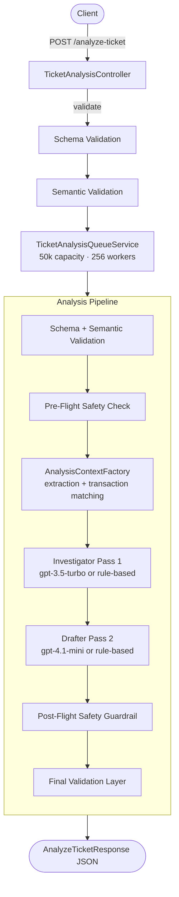

# Sust Preli — Fintech Investigator API

Production-ready Spring Boot API for AI-powered fintech complaint investigation. Incoming support tickets are validated, queued, and processed through a two-pass LLM pipeline with rule-based fallback, safety guardrails, and structured JSON responses suitable for agent dashboards and customer replies.

---

## Live API

| Resource | URL |
|----------|-----|
| **Base API** | https://sust-preli-b8l9.onrender.com |
| **Health check** | https://sust-preli-b8l9.onrender.com/health |
| **Swagger UI** | https://sust-preli-b8l9.onrender.com/swagger-ui.html |
| **OpenAPI JSON** | https://sust-preli-b8l9.onrender.com/v3/api-docs |
| **Main endpoint** | `POST` https://sust-preli-b8l9.onrender.com/analyze-ticket |

Try the API interactively in [Swagger UI](https://sust-preli-b8l9.onrender.com/swagger-ui.html). The OpenAPI spec at `/v3/api-docs` can be imported into Postman, Insomnia, or code generators.

---

## How It Works

A single `POST /analyze-ticket` request triggers the full investigation flow:

1. **Controller** parses the JSON body (supports both flat and wrapped sample formats), runs synchronous pre-queue validation, and submits the job to the in-memory work queue.
2. **Queue** accepts up to 50,000 pending jobs and dispatches them to 256 worker threads. The HTTP request blocks until the job completes or the configured wait timeout is reached.
3. **Pipeline** processes each job through validation, safety checks, two analysis passes, guardrails, and final response assembly.

### Investigation pipeline

Each queued job runs through these stages in order:

| Stage | Purpose |
|-------|---------|
| **Schema validation** | Jakarta Bean Validation on ticket fields and transaction history (HTTP 400 on failure) |
| **Semantic validation** | Business rules: complaint length, duplicate transaction IDs, history size limits (HTTP 422 on failure) |
| **Pre-flight safety** | Detects prompt-injection patterns and adversarial complaints; flags the ticket for mandatory human review |
| **Context assembly** | Rule-based extraction of amounts, intent, and keywords; transaction matching with weighted scoring |
| **Investigator Pass 1** | Classifies evidence verdict, case type, and routing department |
| **Drafter Pass 2** | Drafts agent summary, recommended next action, customer reply, severity, and confidence |
| **Post-flight guardrails** | Sanitizes outputs; blocks unsafe promises, third-party referrals, and policy violations |
| **Final validation** | Parses enum values, normalizes confidence, applies fallbacks, and assembles `AnalyzeTicketResponse` |

### LLM strategy

When AI is enabled and an OpenAI API key is present:

- **Pass 1 (Investigator)** uses `gpt-3.5-turbo` — fast, cost-efficient classification.
- **Pass 2 (Drafter)** uses `gpt-4.1-mini` — higher-quality customer-facing language.

If AI is disabled, the API key is missing, or either LLM call fails or times out, the pipeline **falls back automatically** to deterministic rule-based passes. Extraction always uses rule-based parsing (English, Bangla, and Banglish), so the system remains functional without any external AI provider.

Set `INVESTIGATOR_OPENAI_API_KEY` in production to enable LLM passes. Disable AI entirely with `INVESTIGATOR_AI_ENABLED=false`.

---

## Architecture



**Request path:** Controller validates synchronously, enqueues the job, then awaits the result on the same HTTP connection (long-poll style, default 120 s).

**Failure modes:** Schema errors → 400 · Semantic errors → 422 · Queue full → 503 · LLM timeout → 504 · Unexpected errors → 500.

---

## Tech Stack

| Layer | Technology |
|-------|------------|
| Language | Java 17 |
| Framework | Spring Boot 3.3.5 |
| Build | Maven |
| LLM client | [OpenAI Java SDK](https://github.com/openai/openai-java) (`openai-java` 4.x) |
| API docs | Springdoc OpenAPI (Swagger UI) |
| Validation | Jakarta Bean Validation |
| Mapping | MapStruct |
| Boilerplate | Lombok |
| Container | Docker |
| Hosting | [Render](https://render.com) (Docker web service, health check on `/health`) |

---

## Project Structure

```
src/main/java/com/hackathon/investigator/
├── controller/              # REST endpoints (/health, /analyze-ticket)
├── pipeline/                # Validation layers, safety checks, two-pass orchestration
│   ├── investigator/        # Pass 1 — evidence, case type, department
│   └── drafter/             # Pass 2 — summaries, replies, severity
├── service/                 # Queue, transaction matching, evidence, routing
├── dto/                     # Request/response records
├── enums/                   # Allowed enum values
├── config/                  # AI, queue, and OpenAPI configuration
├── client/                  # Rule-based extraction client
├── exception/               # Global exception handling
└── util/                    # Complaint analysis, safety filters, parsers
```

---

## Quick Start

### Prerequisites

- Java 17+
- Maven 3.9+

### Run locally

```bash
mvn spring-boot:run
```

The API starts at `http://localhost:8080`.

- Swagger UI: http://localhost:8080/swagger-ui.html
- OpenAPI JSON: http://localhost:8080/v3/api-docs

### Run with Docker

```bash
docker compose up --build
```

---

## Environment Variables

| Variable | Default | Description |
|----------|---------|-------------|
| `PORT` | `8080` | HTTP port (Render sets this automatically) |
| `INVESTIGATOR_OPENAI_API_KEY` | empty | OpenAI API key for LLM passes |
| `INVESTIGATOR_AI_ENABLED` | `true` | Set to `false` to force rule-based passes only |
| `INVESTIGATOR_AI_INVESTIGATOR_MODEL` | `gpt-3.5-turbo` | Model for Investigator Pass 1 |
| `INVESTIGATOR_AI_DRAFTER_MODEL` | `gpt-4.1-mini` | Model for Drafter Pass 2 |
| `INVESTIGATOR_AI_PIPELINE_TIMEOUT_SECONDS` | `90` | Total pipeline timeout; each pass gets half |
| `INVESTIGATOR_QUEUE_CAPACITY` | `50000` | Max queued jobs before returning 503 |
| `INVESTIGATOR_QUEUE_WORKERS` | `256` | Worker threads processing the queue |
| `INVESTIGATOR_QUEUE_DEFAULT_WAIT_SECONDS` | `120` | How long the HTTP request waits for a result |

Example — local run with OpenAI:

```bash
export INVESTIGATOR_OPENAI_API_KEY=sk-...
mvn spring-boot:run
```

Example — rule-based only (no external AI):

```bash
export INVESTIGATOR_AI_ENABLED=false
mvn spring-boot:run
```

---

## API Reference

### Health Check

`GET /health`

```json
{ "status": "ok" }
```

### Analyze Ticket

`POST /analyze-ticket`

**Request:**

```json
{
  "ticket_id": "TKT-001",
  "complaint": "I sent 5000 taka to the wrong number.",
  "language": "en",
  "channel": "in_app_chat",
  "user_type": "customer",
  "transaction_history": [
    {
      "transaction_id": "TXN-9101",
      "timestamp": "2026-04-14T14:08:22Z",
      "type": "transfer",
      "amount": 5000,
      "counterparty": "+8801719876543",
      "status": "completed"
    }
  ]
}
```

**Response:**

```json
{
  "ticket_id": "TKT-001",
  "relevant_transaction_id": "TXN-9101",
  "evidence_verdict": "consistent",
  "case_type": "wrong_transfer",
  "severity": "high",
  "department": "dispute_resolution",
  "agent_summary": "Ticket TKT-001 classified as wrong_transfer...",
  "recommended_next_action": "Verify beneficiary details and initiate dispute workflow without promising reversal.",
  "customer_reply": "We understand you may have sent funds to the wrong recipient...",
  "human_review_required": true,
  "confidence": 0.90,
  "reason_codes": ["CASE_WRONG_TRANSFER", "EVIDENCE_CONSISTENT", "PROVIDER_RULE-BASED"]
}
```

Wrapped sample format (used in Swagger examples) is also accepted — the parser unwraps the `input` field automatically.

---

## Transaction Matching Scores

When linking a complaint to transaction history, the matcher applies weighted signals:

| Signal | Score |
|--------|-------|
| Amount match | +5 |
| Type match | +4 |
| Recent time match | +3 |
| Counterparty match | +2 |
| Status match | +2 |

---

## Allowed Enum Values

- `evidence_verdict`: `consistent`, `inconsistent`, `insufficient_data`
- `case_type`: `wrong_transfer`, `payment_failed`, `refund_request`, `duplicate_payment`, `merchant_settlement_delay`, `agent_cash_in_issue`, `phishing_or_social_engineering`, `other`
- `severity`: `low`, `medium`, `high`, `critical`
- `department`: `customer_support`, `dispute_resolution`, `payments_ops`, `merchant_operations`, `agent_operations`, `fraud_risk`
- `transaction_type`: `transfer`, `payment`, `cash_in`, `cash_out`, `settlement`, `refund`
- `transaction_status`: `completed`, `failed`, `pending`, `reversed`

---

## Deploy on Render

1. Push this repo to GitHub.
2. Create a new **Web Service** on Render with **Docker** runtime.
3. Set health check path to `/health`.
4. Add `INVESTIGATOR_OPENAI_API_KEY` (and optionally `INVESTIGATOR_AI_ENABLED`) in Environment.

A `render.yaml` blueprint is included for one-click setup.

---

## Testing

```bash
mvn test
```

Tests cover transaction matching, evidence evaluation, semantic validation, safety filtering, queue behavior, and REST integration.

---

## License

MIT
